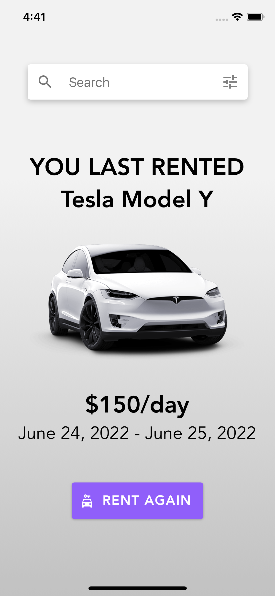

# Search and filter cars (React Native) 🚗
## Introduction
This is a React Native app written in TypeScript that shows the last car you rented and allows you to search for a car by brand name, model, year, color and price range.

The app uses [React Native Paper](https://github.com/callstack/react-native-paper) as a UI library.

## How to run the app
`npm install`

`npm start`

Follow the instructions in the terminal to run the app on the web, iOS or Android.

## Try the app live
You can try it here: https://snack.expo.dev/@thornus/cca815

## Assumptions

- The language is English
- The currency is USD
- The user is connected to the Internet
- The API seems to not support multiple queries at once
- Search input filters cars based on brand name only

## Proposed improvements
- Search using filters only (without typing anything in the search bar). This would mean moving the search to a screen of its own so there’s no need to differentiate between showing the last rented car and the search results.
- Use date picker to choose the year
- More loading indicators

